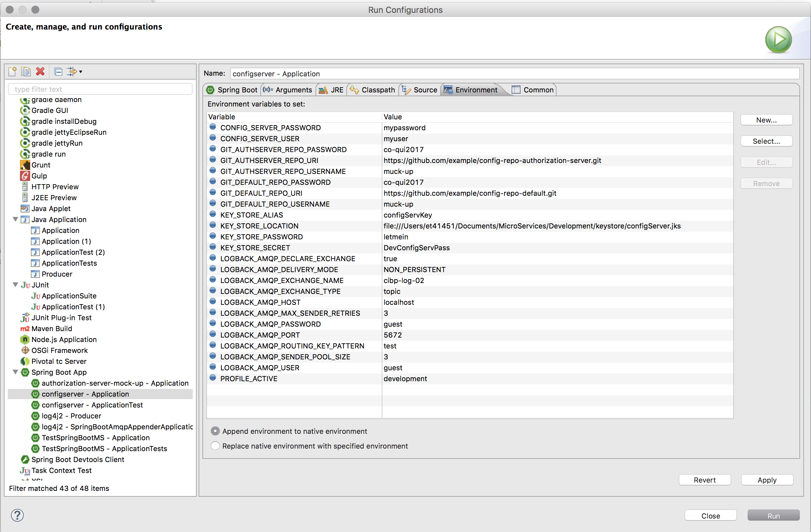

# Spring Cloud Config

>Spring Cloud Config provides server and client-side support for externalized configuration in a distributed system. <br/>With the Config Server you have a central place to manage external properties for applications across all environments. <br/>The concepts on both client and server map identically to the Spring Environment and PropertySource abstractions, so they fit very well with Spring applications, but can be used with any application running in any language. <br/>As an application moves through the deployment pipeline from dev to test and into production you can manage the configuration between those environments and be certain that applications have everything they need to run when they migrate. <br/>The default implementation of the server storage backend uses git so it easily supports labelled versions of configuration environments, as well as being accessible to a wide range of tooling for managing the content. <br/>It is easy to add alternative implementations and plug them in with Spring configuration.<br/>
https://cloud.spring.io/spring-cloud-config/


## Start the server:

The server is a Spring Boot application so you can run it from your Console or IDE instead if you prefer (the main class is **com.evertec.cibp.configserver.Application**).

It is important to notice that the configuration server needs some environment variables (can be more or less in the future. Each repository configured needs its own environment variables). 

* Basic autentication
  * SECRET_CONFIG_SERVER_USER
  * SECRET_CONFIG_SERVER_PASSWORD
* Encrypt key-store (It permits the encryption and decryption of sensitive information in the Git repository.)
  * SECRET_KEY_STORE_LOCATION (the path where the Java Key Store is located) 
  * SECRET_KEY_STORE_PASSWORD (the password of the key store)
  * SECRET_KEY_STORE_ALIAS (the alias of the key store)
  * SECRET_KEY_STORE_SECRET (the secret of the key store)
* Server GIT
  * SECRET_CONFIG_GIT_DEFAULT_REPO (It is required to have one default repository)
  * SECRET_CONFIG_GIT_DEFAULT_USERNAME
  * SECRET_CONFIG_GIT_DEFAULT_PASSWORD

**Run in console:**
```SHELL
java -jar -DSECRET_CONFIG_SERVER_USER=myuser \
-DSECRET_CONFIG_SERVER_PASSWORD=mypassword \
-DSECRET_KEY_STORE_LOCATION=file:///keystore/configServer.jks \
-DSECRET_KEY_STORE_PASSWORD=letmein \
-DSECRET_KEY_STORE_ALIAS=configServKey \
-DSECRET_KEY_STORE_SECRET=DevConfigServPass \
-DSECRET_CONFIG_GIT_DEFAULT_REPO=https://github.com/cesargomezvela/config-repo-default.git \
-DSECRET_CONFIG_GIT_DEFAULT_USERNAME=muck-up \
-DSECRET_CONFIG_GIT_DEFAULT_PASSWORD=co-qui2017 \
configserver-mock-up-0.1.0-SNAPSHOT.jar
```

**IDE configuration**



> The SECRET prefix is important because that reflect that the variable will be provided by the Kubernetes SECRETS mechanism. <br> Avoid replacing these values for text plain in the application.yml instead of that, you should set your environment as shown above


Independently if you resources are properties or YAML files the HTTP service has resources in the form:
```
/{application}/{profile}[/{label}]
/{application}-{profile}.yml
/{label}/{application}-{profile}.yml
/{application}-{profile}.properties
/{label}/{application}-{profile}.properties
```

where the "application" is injected as the spring.config.name in the SpringApplication (i.e. what is normally "application" in a regular Spring Boot app), "profile" is an active profile (or comma-separated list of properties), and "label" is an optional git label (defaults to "master".)

Spring Cloud Config Server pulls configuration for remote clients from a git repository (which must be provided):
```YAML
spring:
  cloud:
    config:
      server:
        git:
          uri: https://github.com/spring-cloud-samples/config-repo
```